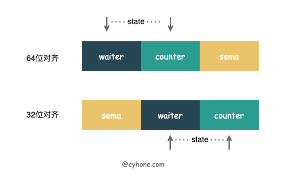

#### sync.WaitGroup 是 Golang 中常用的并发措施，我们可以用它来等待一批 Goroutine 结束。
::::iqqq:


## WaitGroup 的使用和实现逻辑


```
func wordker(id int) {
	fmt.Printf("worder %d starting\n", id)

	time.Sleep(time.Second)
	fmt.Printf("worder %d done\n", id)
}

func main() {
	//WaitGroup 用于等待这里启动的所有协程完成,如果 WaitGroup 显式传递到函数中，则应使用 指针
	var wg sync.WaitGroup

	for i := 1; i <= 5; i++ {
		wg.Add(1) // Add 添加需要等待的个数

		i := i
		//将 worker 调用包装在一个闭包中，可以确保通知 WaitGroup 此工作线程已完成。 这样，worker 线程本身就不必知道其执行中涉及的并发原语。
		go func() {
			defer wg.Done() //Done 来通知 WaitGroup 任务已完成
			wordker(i)
		}()
	}
	wg.Wait() // Wait 来等待所有 goroutine 结束
}

```

## WaitGroup 的组成结构

```
type WaitGroup struct {
    //noCopy 是 golang 源码中检测禁止拷贝的技术
    //如果程序中有 WaitGroup 的赋值行为，使用 go vet 检查程序时，就会发现有报错。但需要注意的是，noCopy 不会影响程序正常的编译和运行。
	noCopy noCopy

	// 64位值:高32位为计数器，低32位为服务员计数。
    // 64位原子操作需要64位对齐，但是32位
    //编译器只保证64位字段是32位对齐的。
    //在32位架构中，我们需要检查state()
    //如果state1是否对齐，如果需要，动态地“交换”字段顺序。
	state1 uint64
	state2 uint32
}
```
### 不考虑内存对齐和并发安全等方面因素,WaitGroup 可以近似的看做以下代码：
```
type WaitGroup struct {
	counter int32 //代表目前尚未完成的个数，WaitGroup.Add(n) 将会导致 counter += n, 而 WaitGroup.Done() 将导致 counter--。
	waiter  uint32 //代表目前已调用 WaitGroup.Wait 的 goroutine 的个数。
	sema    uint32 //对应于 golang 中 runtime 内部的信号量的实现。WaitGroup 中会用到 sema 的两个相关函数，runtime_Semacquire 和 runtime_Semrelease。runtime_Semacquire 表示增加一个信号量，并挂起 当前 goroutine。runtime_Semrelease 表示减少一个信号量，并唤醒 sema 上其中一个正在等待的 goroutine。
}
```

### WaitGroup的整个调用过程简述
1. 当调用 WaitGroup.Add(n) 时，counter 将会自增: counter += n
2. 当调用 WaitGroup.Wait() 时，会将 waiter++。同时调用 runtime_Semacquire(semap), 增加信号量，并挂起当前 goroutine。
3. 当调用 WaitGroup.Done() 时，将会 counter--。如果自减后的 counter 等于 0，说明 WaitGroup 的等待过程已经结束，则需要调用 runtime_Semrelease 释放信号量，唤醒正在 WaitGroup.Wait 的 goroutine。

## WaitGroup 的底层内存结构
state1 长度为uint32，其中 state1 中包含了三个变量的语义和行为，其内存结构如下：

* 我们在图中提到了 Golang 内存对齐的概念。简单来说，如果变量是 64 位对齐 (8 byte), 则该变量的起始地址是 8 的倍数。如果变量是 32 位对齐 (4 byte)，则该变量的起始地址是 4 的倍数。
* 从图中看出，当 state1 是 32 位对齐和 64 位对齐的情况下，state1 中每个元素的顺序和含义也不一样:
   * 当 state1 是 32 位对齐：state1 数组的第一位是 sema，第二位是 waiter，第三位是 counter。
   * 当 state1 是 64 位对齐：state1 数组的第一位是 waiter，第二位是 counter，第三位是 sema。

* 为什么会有这种奇怪的设定呢？这里涉及两个前提:
   * 前提 1：在 WaitGroup 的真实逻辑中， counter 和 waiter 被合在了一起，当成一个 64 位的整数对外使用。当需要变化 counter 和 waiter 的值的时候，也是通过 atomic 来原子操作这个 64 位整数。但至于为什么合在一起，我们会在下文WaitGroup-的无锁实现中详细解释原因。
   * 前提 2：在 32 位系统下，如果使用 atomic 对 64 位变量进行原子操作，调用者需要自行保证变量的 64 位对齐，否则将会出现异常。golang 的官方文档 sync/atomic/#pkg-note-BUG 原文是这么说的：
       * On ARM, x86-32, and 32-bit MIPS, it is the caller’s responsibility to arrange for 64-bit alignment of 64-bit words accessed atomically. The first word in a variable or in an allocated struct, array, or slice can be relied upon to be 64-bit aligned.

   * 因此，在前提 1 的情况下，WaitGroup 需要对 64 位进行原子操作。那根据前提 2，WaitGroup 则需要自行保证 count+waiter 的 64 位对齐。这也是 WaitGroup 采用 [3]uint32 存储变量的目的：

  * 当 state1 变量是 64 位对齐时，也就意味着数组前两位作为 64 位整数时，自然也可以保证 64 位对齐了。
  * 当 state1 变量是 32 位对齐时，我们把数组第 1 位作为对齐的 padding，因为 state1 本身是 uint32 的数组，所以数组第一位也有 32 位。这样就保证了把数组后两位看做统一的 64 位整数时是64位对齐的。
  * 这个方法非常的巧妙，只不过是改变 sema 的位置顺序，就既可以保证 counter+waiter 一定会 64 位对齐，也可以保证内存的高效利用。

Golang 官方文档中也给出了 判断当前变量是 32 位对齐还是 64 位对齐的方法:：
```
uintptr(unsafe.Pointer(&x)) % unsafe.Alignof(x) == 0
```

## WaitGroup 中从 state1 中取变量的方法如下:
```
func (wg *WaitGroup) state() (statep *uint64, semap *uint32) {
	if uintptr(unsafe.Pointer(&wg.state1))%8 == 0 {
		return (*uint64)(unsafe.Pointer(&wg.state1)), &wg.state1[2]
	} else {
		return (*uint64)(unsafe.Pointer(&wg.state1[1])), &wg.state1[0]
	}
}
```